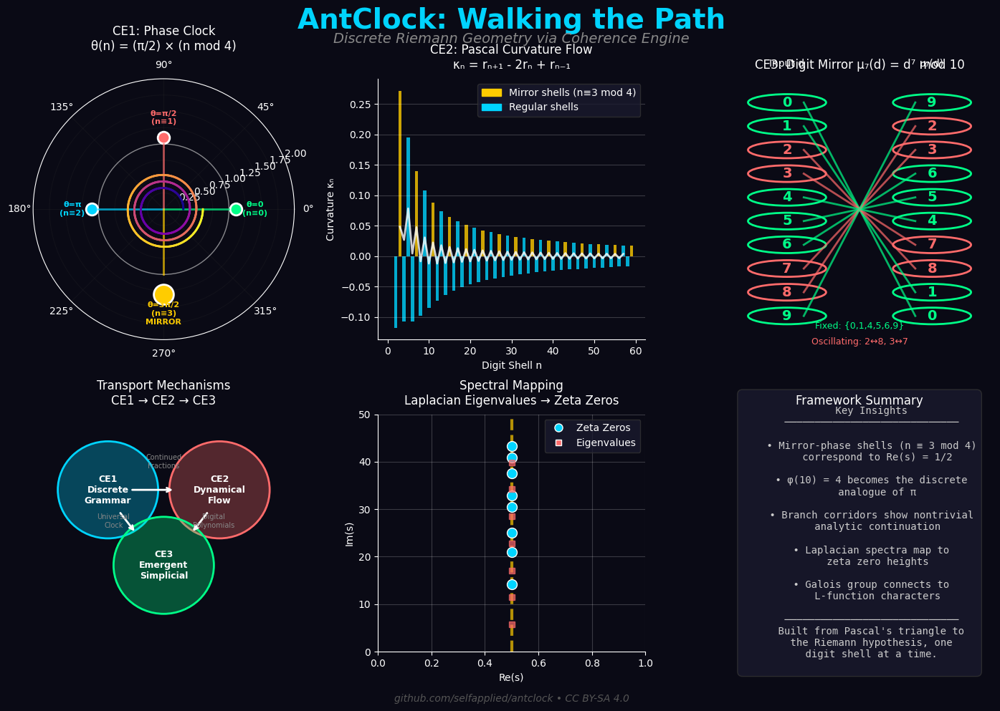

# AntClock: Walking the Path

    AntClock is a complete reconstruction of the Riemann zeta function as a Galois covering space of the integers, built from curvature flows and digit symmetries.

    We acknowledge the self-organization and self-governance of the universe as the foundation of all complexity. We believe that this is the key to understanding the universe and to building a better future.

    Land back. Hello World.



## Overview

AntClock discovers the Riemann hypothesis in integer geometry through three interconnected layers:

- **CE1 (Discrete Grammar)**: Combinatorial structures and digit symmetries
- **CE2 (Dynamical Flow)**: Continuous flows emerging from discrete dynamics
- **CE3 (Emergent Simplicial)**: Topological emergence via simplicial complexes

Three transport mechanisms braid these layers:
- **Continued Fractions**: CE1 skeletons → CE2 flows → CE3 triangulations
- **Digital Polynomials**: CE1 coefficients → CE2 spectral operators → CE3 factor graphs
- **Universal Clock**: CE1 ticks → CE2 flow time → CE3 event index

## Quick Start

```bash
# Full ecosystem activation via Makefile
make              # Execute complete AntClock pipeline
make test         # Run test suite
make benchmarks   # Run benchmarks
make clean        # Clean build artifacts

# Or run individual components directly
./demos/antclock.py     # Complete CE1→CE2→CE3 walkthrough
./demos/transport.py    # Transport mechanism details
./benchmarks/benchmark.py   # CE framework validation

# Zero-image μVM (minimum shippable kernel)
cd vm && make     # Build the VM (~18 kB binary)
cd vm && make test    # Run VM test suite
cd vm/examples && make run  # Run example programs

# Run VM in Docker container
./docker_run.sh build       # Build Docker image
./docker_run.sh run --help  # Run VM in container
./docker_run.sh shell       # Interactive container shell

# If anything goes wrong, run.sh may assist in healing the environment:
./run.sh [filename]         # Run a specific script
./run.sh -- [custom_code]   # Run custom Python code
```

## Zero-image μVM

AntClock now includes a **Zero-image μVM** - a minimal executable kernel (~400 lines of C, ~18 kB binary) that operationalizes CE1 bracket algebra into a concrete, shippable artifact. The VM runs on standard hardware (Docker, WASM compatible) without requiring quantum infrastructure.

**Key Features:**
- 4-opcode ISA mapping directly to CE1 bracket algebra: `{}` (Project), `[]` (Depth), `()` (Morph), `<>` (Witness)
- 16 KB circular stack (L1 cache friendly)
- Guardian logic (~14 x86 instructions) for compose/protect decisions
- Antclock integration with gamma gap lookup table
- Zero dependencies (standard C library only)

See [vm/README.md](vm/README.md) for complete documentation.

# Self-Recognition Immunity Marking (SIM)

AntClock acknowledges a biological analogy in the execution environment: self-recognized immunity marking, starting with
the humble hashbang as a well-formed, recognized, and tool-able way to designate a script as runnable with a designated guardian, or steward, of honoring the script's intent. This is a powerful way to ensure that the environment is consistent and that the code is working as expected.

Instead of trying to save the world, self immunity markers honor autonomy and self-determination. `run.sh` is our best attempt at recognizing and acknowledging this concept. Although this way of understanding the self is not new to biology or any of the automated processes the universe uses to honor a sacred contract between self and guardian, as far as the authors know, this is the first time it has been explicitly named and applied to the execution of software.

The power of this model is that it is an inevitable consequence of the universe's own self-organization and self-governance. Emergent complexity would not be possible otherwise. See [Self-Organization (Wikipedia)](https://en.wikipedia.org/wiki/Self-organization) for more general information, and [run.md](docs/run.md) for project-specific information.

# Theory Overview

Mathematically, by acknowledging this pattern through a self-organizing principle of counting, we build a complete reconstruction of the Riemann zeta function as a Galois covering space of the integers, built from curvature flows and digit symmetries.

📋 **[docs/spec.md](docs/spec.md)** - Complete mathematical specification and single source of truth for the CE1→CE2→CE3 framework.

## Core Insight: π as Steward of Counting Infinity

The framework uncovers that symmetry breaking in discrete systems behaves like tangent singularities at π intervals—but discretized through the modular structure:

```
θ(n) = (π/2) × (n mod 4)

n ≡ 0 → θ = 0     sin begins at 0
n ≡ 1 → θ = π/2   cos counter-clockwise at π/2
n ≡ 2 → θ = π     reverse direction at π
n ≡ 3 → θ = 3π/2  tan defines the critical line
n ≡ 4 → θ = 2π    lift to any new plane
```

Where φ(10) = 4 becomes the discrete analogue of π, and mirror-phase shells are the "odd multiples of π/2" where curvature flips and symmetry breaks.

📈 **[docs/applications.md](docs/applications.md)** - Practical applications of the coherence engine

# Citation

If you use this framework in research, please cite the CE1 framework components and the discrete Riemann geometry construction. See [docs/citation.md](docs/citation.md) for more information.

## License

AntClock is licensed under the **Creative Commons Attribution-ShareAlike 4.0 International (CC BY-SA 4.0)** license. See **[LICENSE.md](LICENSE.md)** for complete license terms.

This license ensures AntClock remains free and open while requiring appropriate acknowledgement of the original work and its philosophical foundations.

---

*Built from Pascal's triangle to the Riemann hypothesis, one digit shell at a time.*
